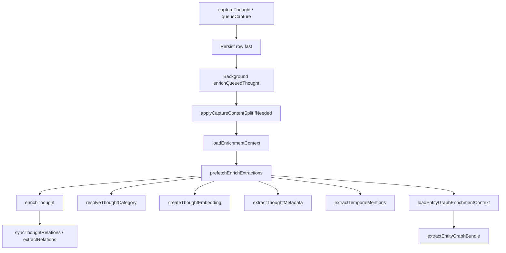

# Capture ingest LLM overhead

Analysis of what runs when a single short thought is ingested, why dev logs look enormous, and whether the current multi-call pipeline is proportionate.

**Related:** [`ingest-retrieval-timing.md`](ingest-retrieval-timing.md) (instrumentation and phase keys).

---

## Short answer

A 131-character note triggers **8 chat-completions + 3 embedding calls**. Terminal output can exceed **750 lines** because each call logs full system/user prompts and responses, and the **grounding profile is pasted into multiple calls**.

That log volume is mostly a **logging and duplication artifact** — but the **~8 round trips and ~74s background enrich** (observed on a short verification note) are real and over-scaled for trivial input.

---

## Pipeline (queue → enrich)

| # | Function | Module | Typical LLM label |
|---|----------|--------|-------------------|
| 1 | `resolveCaptureContentSplit` | [`split-capture-content.ts`](../../src/lib/server/capture/split-capture-content.ts) | `[llm.chat:chat]` |
| 2 | `extractThoughtMetadata` | [`extract-thought-metadata.ts`](../../src/lib/server/memory/extract-thought-metadata.ts) | `[llm.chat:chat]` |
| 3 | `extractTemporalMentions` | [`temporal-extraction.ts`](../../src/lib/server/memory/temporal-extraction.ts) | `[llm.chat:chat]` |
| 4 | `resolveThoughtCategory` | [`classify-thought-category.ts`](../../src/lib/server/ontology/classify-thought-category.ts) | `[llm.chat:thought_category]` |
| 5 | `createThoughtEmbedding` | [`embedding.ts`](../../src/lib/server/llm/embedding.ts) | `[llm.embedding]` |
| 6 | `extractEntityGraphBundle` | [`entity-extraction.ts`](../../src/lib/server/memory/entity-extraction.ts) | `[llm.chat:chat]` |
| 7 | Entity mention embeddings | entity resolution | `[llm.embedding]` × N |
| 8 | `detectAndCreateProjectFromThought` | [`detect-project-from-thought.ts`](../../src/lib/server/memory/detect-project-from-thought.ts) | `[llm.chat:chat]` |
| 9 | Retrieval rerank (inside `searchThoughts`) | [`relation-extraction.ts`](../../src/lib/server/memory/relation-extraction.ts) | `[llm.chat:retrieval_rerank]` |
| 10 | `extractRelations` | [`relation-extraction.ts`](../../src/lib/server/memory/relation-extraction.ts) | `[llm.chat:chat]` |

**Orchestration:** [`enrich-queued-thought.ts`](../../src/lib/server/capture/enrich-queued-thought.ts) prefetches category, metadata, temporal in parallel; entities after embedding. [`enrich.ts`](../../src/lib/server/capture/enrich.ts) syncs graph, GTD, project detection, then relations inline (`deferRelations: false`).

---

## Why logs look like one giant prompt

1. **Verbose dev logging** — [`llm-client.ts`](../../src/lib/server/llm/llm-client.ts) prints full messages per call.
2. **Repeated grounding profile** — [`groundingProfilePromptBlock`](../../src/lib/server/grounding/prompt-block.ts) is injected into metadata, category, and entity prompts independently (~400–500 words each).
3. **Static instruction schemas** — temporal, entity, and relation prompts ship long JSON schemas (LLM-as-judge policy; see [no-string-heuristics](../../.cursor/rules/no-string-heuristics.mdc)).

---

## Example measurements (131-char verification note)

| Call | Prompt tokens | Completion tokens | Latency |
|------|---------------|-------------------|---------|
| Content split | 483 | 78 | ~0.9s |
| Memory type + cues | 662 | 58 | ~0.7s |
| Temporal | 832 | 2 | ~1.5s |
| Category | 1,340 | 70 | ~21.6s |
| Entity graph | 2,601 | 119 | ~30.2s |
| Project detect | 259 | 10 | ~2.9s |
| Retrieval rerank | 890 | 139 | ~5.1s |
| Relations | 1,040 | 107 | ~0.8s |
| **Chat subtotal** | **~7,107** | **~583** | |
| + embeddings | — | — | 1 thought + N mentions |

- **Wall time:** `[capture.timing] wallMs` ~74s (category + entity dominated gateway latency).
- **Billing precheck:** 50 credits (`assertCapturePipelineAffordable`).

---

## Quality issues observed

- **Metadata cues drift:** `extractThoughtMetadata` returned search phrases from the grounding profile (Hermes, eigenmesh) instead of the capture text when the note was short and profile-heavy.
- **Entity type mismatch:** `agent` typed as `person` for a software-authorship note.
- **Irrelevant community context:** lexical-retrieved community summaries (unrelated themes) injected into entity prompt.

---

## Incremental mitigations (implemented)

| Change | Rationale |
|--------|-----------|
| **`extractEnrichThoughtBundle`** | Single LLM call for category, memory type, cues, temporal, and entities — grounding injected once |
| Capture-first prompt sections | Capture text precedes grounding in all enrich LLM prompts; explicit cues-from-capture rule |
| `deferRelations: true` on queue enrich | Relations + rerank LLM run via `scheduleRelationEnrichment` after core enrich |

---

## Possible optimizations (remaining)

1. Skip content-split LLM below a char threshold when input has no structural signals — format gate only.
2. Reduce log verbosity in dev — truncate grounding blocks in `[llm.chat:*]` logs.

---

## Verdict

**Product architecture** (autonomous enrich, LLM-as-judge, fast persist + background worker) is intentional for Open Brain–style memory.

**Operational scale** for a one-line note is improved by batched enrich prefetch and deferred relations; further gains from content-split gating and log truncation.
