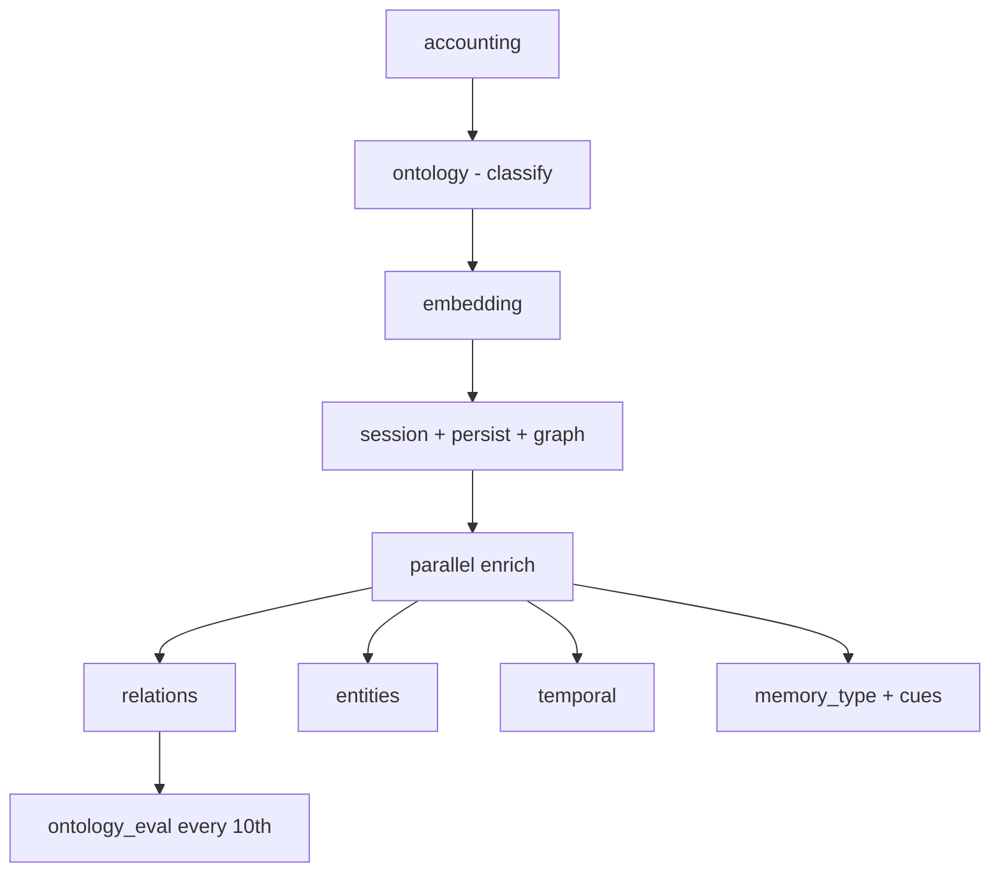
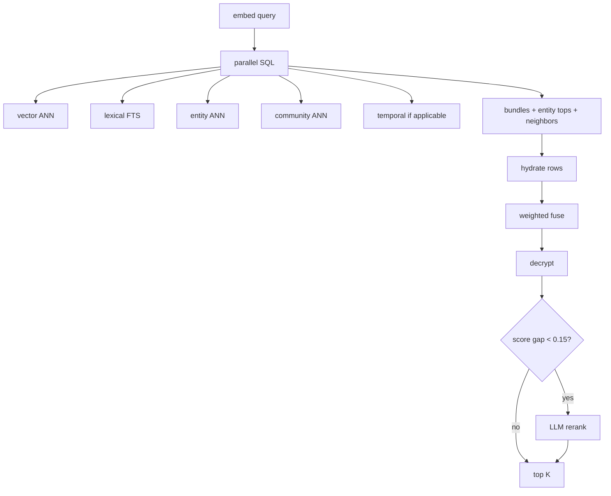

# Ingest and retrieval timing

How long capture and retrieval take, what each step does, which LLM/embedding calls fire, and where time is spent.

**Instrumentation:** `captureThought` records per-step durations via [`src/lib/server/capture/phase-timing.ts`](../../src/lib/server/capture/phase-timing.ts) and logs `[capture.timing]` on completion. Retrieval logs `[retrieval.retrieveEvidence]` from [`src/lib/server/retrieval/phase-timing.ts`](../../src/lib/server/retrieval/phase-timing.ts).

**Reproduce ingest timings:**

```bash
npm run measure:ingest
```

Optional env: `MEASURE_INGEST_TEXT`, `MEASURE_INGEST_USER_ID`, `MEASURE_INGEST_BILLING_USER_ID`, `MEASURE_INGEST_AWAIT_ENRICHMENT=true` (full await path for comparison).

---

## Three memory tiers (capture → recall)

Eigenmesh builds memory in three layers. The same `thought` row gains capabilities over time; nothing is copied to a separate “hot” store.

| Tier | When | What is stored / built | Recall channel |
|------|------|------------------------|----------------|
| **1 — Hot** | On submit (~tens of ms) | Full text, `lexical_text` (keyword index surface), graph thought node, `enrich_queue_status=pending` | **Keyword / full-text search** on `lexical_text` — should work immediately, no LLM |
| **2 — Enrich** | Background worker (seconds–minutes, FIFO per user) | Category, **embedding** (semantic vector), entities, temporal events, `memory_type`, `cues[]`, `thought_entity`, `thought_neighbor`, `enriched_at` | **Semantic search** (vector ANN) plus richer graph links |
| **3 — Consolidation** | Nightly heartbeat + incremental dirty refresh | `community_detection`, `community_summary`, `community_bundle`, salience/recency features, `entity_top_thoughts` backfill, ontology prune/dedup | **Community routing** — “which cluster of memories is this question about?” then expand top thoughts in that cluster |

**Code:** tier 1 [`queue-capture.ts`](../../src/lib/server/capture/queue-capture.ts); tier 2 [`enrich-queued-thought.ts`](../../src/lib/server/capture/enrich-queued-thought.ts) + [`capture-enrich-worker.ts`](../../src/lib/server/capture/capture-enrich-worker.ts); tier 3 [`src/lib/server/consolidation/`](../../src/lib/server/consolidation/) (`HEARTBEAT_JOB_PLAN`: community summaries, bundles, salience, etc.).

UI queue uses [`CAPTURE_FAST_PIPELINE`](../../src/lib/capture/ingest-phases.ts) for tier-1 progress; [`pollUntilEnrichmentComplete`](../../src/lib/capture/poll-enrichment.ts) refreshes the stored card when tier 2 sets `enriched_at`.

Eval harness queues tier-1 capture immediately (`awaitEnrichment: false`) and verifies entities/embeddings at the **check** step via `waitForThoughtEnrichment` (same production enrich worker, not inline on the capture step).

### Plain-language glossary

- **Full-text search (FTS)** — Postgres finds rows whose **words overlap** the query (e.g. query “Priya book” matches text containing “Priya” and “book”). Fast, exact on names and rare tokens. In this codebase the implementation lives in [`lexical.ts`](../../src/lib/server/retrieval/lexical.ts); we often say **lexical** search because it uses the precomputed `lexical_text` column (folded lowercase text), not because it is a different thing from FTS.
- **Semantic / vector search** — Text is turned into a **number vector** (embedding). Similar *meaning* → vectors close together, even when words differ (“automobile” vs “car”). Requires tier-2 `embedding` on the thought row. Implemented as **ANN** (approximate nearest neighbor): a fast index over millions of vectors that finds “close enough” neighbors without scanning every row.
- **Graph / community expansion** — Tier 2 links thoughts to entities and neighbors; tier 3 groups thoughts into **communities** with short summaries. Retrieval can pull “other thoughts in the same cluster” without re-reading the live graph database at query time.

**`answer_question` does give full text to the LLM** — but only for thoughts that **win the retrieval race** first. Flow: embed the question → search (FTS + vectors + precomputed links merged) → take top K thought **full texts** → compose LLM writes the answer with citations. Strong FTS hits are boosted in fusion and reserved in the rerank pool so tier-1 rows beat unrelated graph expansion (see retrieval.md § Hot-path FTS priority).

---

## How to read timings

| Surface | What you get |
|---------|----------------|
| **`/activity`** | Per gateway call: `durationMs`, cost, model — best source for individual LLM latency |
| **`[capture.timing]`** | Per ingest phase + `wallMs` (end-to-end) + `phaseSumMs` (sum of phases; exceeds `wallMs` when enrich steps ran in parallel) |
| **`[composeAnswer]`** | `embedding`, `searching`, `composing`, `totalDurationMs` |
| **`[retrieval.retrieveEvidence]`** | Phase marks + `totalMs` (marks are tail timings from phase start → finish, not isolated step durations) |

**Per-user LLM queue:** successive LLM/embedding calls for the same user are spaced by `LLM_MIN_REQUEST_INTERVAL_MS` (default **1000 ms**). Ingest runs many sequential calls; queue spacing adds seconds on top of model latency.

---

## Ingest pipeline (`captureThought`)

Canonical UI order: [`src/lib/capture/ingest-phases.ts`](../../src/lib/capture/ingest-phases.ts).



### Instrumented phases

| Phase key | What happens | LLM / embedding | Outputs |
|-----------|----------------|-----------------|---------|
| `ensure_ontology_seeded` | Seed baseline ontology kinds if missing | — | `ontology_entity_kind` rows |
| `accounting` | `assertCapturePipelineAffordable` | — | Billing gate |
| `normalize` | Trim / collapse whitespace | — | Normalized text + metadata |
| `load_entity_hints` | Lexical + graph entity hints for classify/extract | — | Hint list (in-memory) |
| `classify_category` | `resolveThoughtCategory` | **1× chat** | Category, confidence, alternatives |
| `embedding` | `createThoughtEmbedding` | **1× embedding** | 1536-dim vector |
| `persist_session_encrypt` | Tenant encrypt raw/normalized | — | Ciphertext blobs |
| `persist_dedup` | Insert `capture_session` + near-dup ANN check | — | `capture_session` |
| `persist_insert` | Insert `thought` row | — | `thought` + `lexical_text` + embedding |
| `graph_anchor` | `upsertThoughtNode` | — | AGE thought node |
| `enrich_bump_version` | Increment `enrichment_version` | — | Version bump |
| `enrich_entities` | `syncEntityGraphFromThought` | **1× chat** (up to 3 retries) + **0–N embeddings** (new canonical entities) | `entity_resolution_log`, AGE entity edges |
| `enrich_metadata` | `extractThoughtMetadata` | **1× chat** | `memory_type`, `cues` |
| `enrich_temporal` | `syncTemporalEventsFromThought` | **1× chat** | `temporal_event` rows + graph jobs |
| `materialize_links` | Precompute retrieval link tables | — | `thought_entity`, `thought_neighbor`, `rerank_snippet`, … |
| `mark_enriched` | Set `enriched_at` | — | Timestamp |
| `ontology_eval` | Every **10th** thought: refresh ontology profile | **0–1× chat** | `user_ontology.profile` |
| `relations_extract` | `extractRelations` (includes nested `searchThoughts`) | **0–1× rerank** + **0–1× chat** | Candidate relations |
| `relations_persist` | Postgres + AGE relation edges + neighbors | — | `thought_relation`, AGE edges |
| `enrich_relations` | Wrapper for relations block | — | — |
| `load_result` | `loadThoughtCaptureResult` | — | `CaptureSubmitResult` to caller |

Classify and embed are **sequential** (same per-user LLM queue).

### Typical LLM budget per capture

| Call | Count (typical) |
|------|-----------------|
| Category classify | 1 |
| Thought embed | 1 |
| Entity graph bundle | 1 (up to 3 on retry) |
| Metadata (type + cues) | 1 |
| Temporal extract | 0–1 |
| Entity resolution embed | 0–N (per new ambiguous entity) |
| Nested retrieval rerank (relations) | 0–1 |
| Relation classify | 0–1 |
| Ontology refresh | 0–1 (every 10th thought) |

**Typical: ~5–6 chats + 1 embedding.** Worst case with retries, many new entities, relations, and ontology eval: **9+ chats**.

### Measured sample — fast path (2026-06-05, default `awaitEnrichment: false`)

**Command:** `npm run measure:ingest`

| Metric | Value |
|--------|-------|
| Wall clock (`wallMs`) | **~2.6 s** (vs ~12.2 s with awaited enrich) |
| `enrichmentComplete` at return | **false** (background enrich continues) |

Dominant phases: `embedding` (~1.6s) + `classify_category` (~1s). Persist/graph under 20ms.

### Measured sample — full await path (2026-06-05, legacy)

**Command:** `npm run measure:ingest`

**Input:** `Met with Sarah at the coffee shop yesterday. She wants a follow-up next Wednesday before the Berlin trip deadline.`

**Tenant:** `eval-corpus-eval-runner-operator` · **Model:** `qwen3-coder-30b-a3b` (via EURouter)

| Metric | Value |
|--------|-------|
| Wall clock (`wallMs`) | **12,150 ms** |
| Phase sum (`phaseSumMs`) | 13,363 ms (parallel enrich overlap) |
| Category | `task` |
| Memory type | `episode` |
| Entities | 5 |
| Temporal events | 3 |
| Linked thoughts | 0 |
| Enrichment complete | yes |

**Phases slowest → fastest:**

| Phase | ms | % of wall |
|-------|-----|-----------|
| `enrich_entities` | 7,636 | 63% |
| `enrich_temporal` | 2,860 | 24% |
| `enrich_metadata` | 1,195 | 10% |
| `classify_category` | 1,125 | 9% |
| `embedding` | 360 | 3% |
| `materialize_links` | 43 | &lt;1% |
| `enrich_relations` | 43 | &lt;1% |
| All other phases | &lt;30 each | &lt;1% |

**Interpretation for this run:**

- **~87% of wall time** was LLM-heavy enrich + classify (`enrich_entities` + `enrich_temporal` + `enrich_metadata` + `classify_category`), with entities dominating because of one large entity-graph chat plus **five sequential entity-resolution embeddings** (queue spacing between each).
- **Postgres / graph / persist** combined were under **100 ms**.
- **Relations** were cheap (25 ms extract) — no prior thoughts to link, so no relation LLM.
- **`ontology_eval`** was 0 ms (not the 10th thought for this corpus user).

---

## Retrieval pipeline (`retrieveEvidence`)

Single path for MCP, HTTP search, and Q&A context. See [`docs/repo-map/retrieval.md`](../repo-map/retrieval.md).



| Phase | What happens | LLM / embedding |
|-------|----------------|-----------------|
| embed | Query embedding (cached per user+text) | 0–1× embedding |
| vector / lexical / entity | Parallel Postgres ANN + FTS | — |
| graph | `community_bundle`, `entity_top_thoughts`, `thought_neighbor` | — |
| hydrate / fuse / decrypt | Merge, score, decrypt top pool (15) | — |
| rerank | `rerankCandidates` if top-2 gap &lt; 0.15 | 0–1× chat |

**Typical retrieval:** 1 embedding + 0–1 rerank. SQL phases are usually **ms–tens of ms**.

In the sample ingest above, nested `relations_extract` retrieval logged **22 ms total** (embedding reused from capture).

---

## Q&A (`composeAnswer`)

1. **Embedding** — query embed (logged)
2. **Searching** — one `searchThoughts` + conflict/temporal hydration + contradiction detection
3. **Composing** — **1× chat** with retrieved thoughts

**Typical Q&A: 2–3 LLM calls** (1 embed + 0–1 rerank + 1 compose). Compose is often the single slowest step when the prompt is large.

---

## Biggest time consumers (summary)

### Ingest

1. **LLM calls × (model latency + queue spacing)** — dominant
2. **`enrich_entities`** — entity graph chat + per-mention resolution embeddings
3. **`enrich_temporal`** + **`enrich_metadata`** — parallel with entities but still LLM-bound
4. **`classify_category`** — first sequential LLM on the hot path
5. **`relations_extract`** — hidden cost when corpus has linkable thoughts (full retrieval + relation LLM)
6. **AGE / Postgres** — usually minor vs LLM

### Retrieval

1. Query **embedding**
2. **Rerank** LLM (when fusion scores are close)
3. **Compose** LLM (Q&A only)
4. Tenant **decrypt** (CPU, smaller than LLM)

---

## Related files

| File | Role |
|------|------|
| [`src/lib/server/capture/service.ts`](../../src/lib/server/capture/service.ts) | Ingest orchestration + timing |
| [`src/lib/server/capture/enrich.ts`](../../src/lib/server/capture/enrich.ts) | Enrichment steps + timing |
| [`src/lib/server/capture/phase-timing.ts`](../../src/lib/server/capture/phase-timing.ts) | Ingest timer + log helper |
| [`scripts/measure-ingest-timing.ts`](../../scripts/measure-ingest-timing.ts) | One-shot measured capture |
| [`src/lib/server/retrieval/retrieve-evidence.ts`](../../src/lib/server/retrieval/retrieve-evidence.ts) | Unified retrieval |
| [`src/lib/server/qa/compose-answer.ts`](../../src/lib/server/qa/compose-answer.ts) | Q&A with phase logs |
| [`docs/repo-map/retrieval-baseline.md`](../repo-map/retrieval-baseline.md) | Historical pre-unified retrieval costs |
