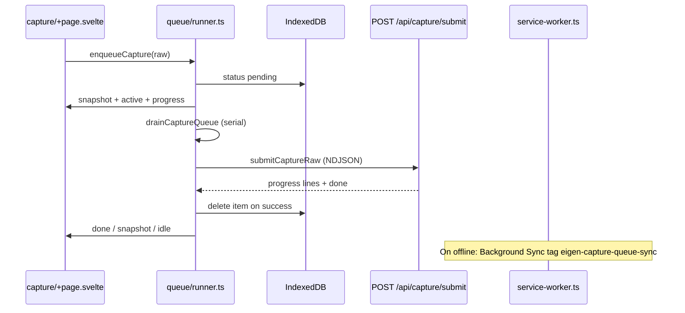

# Client capture queue

**Canonical rule:** New thought submits from `/capture` go through the **browser capture queue** ([`src/lib/capture/queue/`](../../src/lib/capture/queue/)), not a blocking in-page `fetch` to `/api/capture/submit`. Server-side ingest still runs only in [`src/lib/server/capture/service.ts`](../../src/lib/server/capture/service.ts) via the submit API.

Post-capture **edits** on the stored thought still use a direct NDJSON `fetch` to `/api/capture/edit` from the capture page (no queue).

## User-visible behavior

1. User enters text (or voice transcript) and clicks **Capture**.
2. Text is cleared immediately; the thought is **enqueued** in IndexedDB (`eigen-capture-queue`).
3. The queue panel lists each item (preview, status). The active item shows **ingest step progress** via [`IngestPhaseIndicator`](../../src/lib/components/ingest-phase-indicator.svelte) (NDJSON phases from the server).
4. Each row has a **remove** control (red ✕) that drops **only that item**; removing the in-flight item aborts its submit and continues the queue.
5. When an item completes, the page shows the latest **stored thought** card; further queued items keep draining **one at a time**.
6. Reloading the page restores queue state from IndexedDB; the layout runner recovers stuck `processing` rows and resumes drain.

## Architecture

### Key modules

| Module | Role |
|--------|------|
| [`queue/db.ts`](../../src/lib/capture/queue/db.ts) | IndexedDB store `items`: `pending` → `processing` → removed (success) or `failed` |
| [`queue/runner.ts`](../../src/lib/capture/queue/runner.ts) | `startCaptureQueueRunner()` in [`+layout.svelte`](../../src/routes/+layout.svelte); `enqueueCapture`, `cancelCaptureQueueItem`, `subscribeCaptureQueue`, `getCaptureQueueSnapshot` |
| [`queue/drain.ts`](../../src/lib/capture/queue/drain.ts) | Processes one pending item at a time; broadcasts lifecycle messages |
| [`queue/submit-capture.ts`](../../src/lib/capture/queue/submit-capture.ts) | `fetch` submit with `Accept: application/x-ndjson`; [`consume-capture-ndjson.ts`](../../src/lib/capture/consume-capture-ndjson.ts) parses progress |
| [`queue/snapshot.ts`](../../src/lib/capture/queue/snapshot.ts) | Builds `snapshot` broadcasts including full `items[]` for the UI list |
| [`queue/ui-state.ts`](../../src/lib/capture/queue/ui-state.ts) | Pure helpers for snapshot/active reconciliation (unit-tested) |
| [`components/capture-queue-list.svelte`](../../src/lib/components/capture-queue-list.svelte) | Per-item queue rows and remove control |
| [`capture-progress.ts`](../../src/lib/capture/capture-progress.ts) | Maps `ProgressEvent` → pipeline step labels (used by indicators) |

### Broadcast contract (`CaptureQueueBroadcast`)

Subscribers (capture page) must handle:

- **`snapshot`** — `{ items, pending, processingId }`; authoritative list and counts.
- **`active`** — Current item id + raw text; resets step progress for that id.
- **`progress`** — `{ id, event }` for NDJSON phases; only applied when `id` matches the active processing id.
- **`done`** — `{ id, thought }`; updates stored-result UI; then reconcile from DB.
- **`failed`** — `{ id, error }`; item remains in DB as `failed` until removed.
- **`idle`** — No pending work; reconcile queue UI.

**Delivery:** `runner.emit()` notifies listeners in the **same tab synchronously**, then posts on `BroadcastChannel` for other tabs (echo deduped by tab origin). Do not rely on `postMessage` alone for the draining tab.

### Cancel semantics

- **`cancelCaptureQueueItem(id)`** deletes the row in IndexedDB.
- If that id is the item currently draining, the runner **aborts** the in-flight `fetch` (`AbortSignal` on the drain).
- User cancel must **not** re-queue the item on abort (delete happens before abort; `process-item` only reverts to `pending` if the row still exists).

### Offline and service worker

- While offline, enqueue registers **Background Sync** (`CAPTURE_QUEUE_SYNC_TAG`).
- [`service-worker.ts`](../../src/service-worker.ts) drains the queue without NDJSON progress (`streamProgress: false`) and posts the same broadcast shapes to open clients.
- When online, the layout runner calls `kickDrain()` again.

### Retry policy

Failed submits retry up to **3** attempts in the queue processor, then `status: failed` with `lastError`. Aligns with project ingest retry guardrails; no silent drop.

## UI layout on `/capture`

1. Thought card (textarea, voice, **Capture** only — no global cancel).
2. When the queue is non-empty: **one card per queued item** (preview, status, remove ✕). Only the **processing** item’s card embeds **IngestPhaseIndicator** for live steps.
3. Error line and **stored thought** card when the latest item completes.

## What not to do (agent guardrails)

- Do **not** wire new capture submits on `/capture` as a direct `fetch('/api/capture/submit')` from the page; use `enqueueCapture`.
- Do **not** replace per-item cancel with a single “cancel all” unless product explicitly asks.
- Do **not** persist NDJSON progress events in IndexedDB for reload; only queue **items** persist. After reload, step UI restarts until the next progress line arrives.
- Do **not** run multiple concurrent drains on the same queue in one tab (`kickDrain` single-flight).

## Related docs

- Server ingest contract: [ingestion.md](./ingestion.md)
- Routes and PWA: [ui-surfaces.md](./ui-surfaces.md)
- Product acceptance (persist on submit, retries): [`docs/planning/02-acceptance-criteria.md`](../planning/02-acceptance-criteria.md) — queue is transport; **AC-001** still applies to the server persist outcome.
