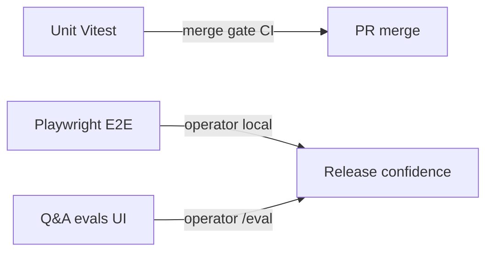

# Testing Eigen

How this product is tested, how to run the suite, and what CI enforces.

## What this app is (test-relevant shape)

Eigen is Open Brain–style **memory infrastructure**: raw thought capture → autonomous ingest/enrichment → hybrid retrieval (pgvector + lexical + Apache AGE) → MCP / Q&A / Projects. Critical domains under test:

| Domain             | What must stay correct                                          |
| ------------------ | --------------------------------------------------------------- |
| Capture / ingest   | Persist on submit, enrich, embed, lexical surface, graph sync   |
| Retrieval / Q&A    | Hybrid RRF, evidence compose, no string-heuristic routing       |
| Memory / entities  | LLM-as-judge extraction, GTD project promotion, temporal events |
| Auth / tenancy     | Better Auth + RLS (`user_id`)                                   |
| MCP / agents       | Tool contracts, embeddings never in tool/LLM payloads           |
| Billing / activity | Per-call cost + markup transparency                             |

Architecture map: [docs/repo-map/index.md](../repo-map/index.md). Product requirements: [docs/planning/01-requirements-baseline.md](../planning/01-requirements-baseline.md).

## Test layers



### 1. Unit tests (Vitest) — **merge-blocking**

- Config: [vitest.config.ts](../../vitest.config.ts) (includes `src/**`, `evals/harness/**`, `scripts/**`; excludes `*.e2e.ts` and `*.svelte.spec.ts`).
- Coverage thresholds: [vite.config.ts](../../vite.config.ts) — enforced when `CI=true` or `vitest run` (see `enforceCoverageThresholds`).
- Risk tiers and globs: [03-guardrails-quality-gates.md](../planning/03-guardrails-quality-gates.md).

```bash
npm run test:unit          # full suite once
npm run test:unit:watch    # watch mode
npm run test:coverage      # suite + v8 coverage (thresholds on CI / vitest run)
```

Run a slice while fixing:

```bash
npm run test:unit -- src/lib/server/capture/service.spec.ts
```

### 2. Playwright E2E — **operator-owned (not CI merge gate today)**

```bash
npm run test:e2e                      # full Playwright suite (needs local stack)
npm run test:e2e:release:headed       # headed release smoke
```

Requires Docker/Postgres and app env; see [README.md](../../README.md).

### 3. Q&A evals — **operator-owned via `/eval` UI**

Do **not** treat CLI eval scripts as the agent’s verification path. After eval-related code changes, run **unit** harness specs only; the operator validates end-to-end from the UI:

- One catalog question: `/eval` → **Questions & answers** → **Run**
- Smoke / all: `/eval` → **Runs** → **Start run**
- Fresh corpus: `/eval` → **Runs** → **Reset corpus & start**

Scripts `eval`, `eval:smoke`, `eval:all`, etc. exist in `package.json` for operators who prefer CLI; agents must not run them (see [AGENTS.md](../../AGENTS.md)).

## CI workflows

| Workflow                                                                                   | What it runs                                                                                                                                    |
| ------------------------------------------------------------------------------------------ | ----------------------------------------------------------------------------------------------------------------------------------------------- |
| [`.github/workflows/test-coverage.yml`](../../.github/workflows/test-coverage.yml)         | **Required:** `lint` → `check` → `test:unit`. **Reported:** `test:coverage` with `CI=true` (`continue-on-error` until tier thresholds are met). |
| [`.github/workflows/oss-secrets-guard.yml`](../../.github/workflows/oss-secrets-guard.yml) | `assert:oss-secrets` + its unit spec                                                                                                            |

If `test` / `test:unit` / `test:coverage` scripts are missing from `package.json`, CI and local workflows are broken — restore them; do not treat the suite as optional.

### Coverage thresholds (target vs enforced floors)

Defined in [vite.config.ts](../../vite.config.ts) and documented in [03-guardrails-quality-gates.md](../planning/03-guardrails-quality-gates.md):

- Critical (`capture|retrieval|llm|pricing|validation|observability|memory|ingest|activity`): **95%** product target; **enforced floors** in `vite.config.ts` are ratcheted to current measured coverage (~89% lines / ~77% branches) so `npm run test:coverage` fails on regressions. Raise floors toward 95% as specs land.
- High (`db`, `auth.ts`, `auth-form-errors.ts`, `routes/**/+server.ts`): **~80%** (routes currently meet the high-tier floors).

When critical floors reach 95%, make the coverage CI job required (drop `continue-on-error`).

## Writing and maintaining unit tests

### Prefer fixing mocks, not loosening assertions

When production Drizzle chains grow (`.orderBy`, `.limit`, `.execute`, `.innerJoin`, `selectDistinct`), update the **test double** so it matches the real chain. Do not delete assertions or skip tests to stay green ([fix-root-cause-not-workaround](../../.cursor/rules/fix-root-cause-not-workaround.mdc)).

Pattern used across server specs — a where-clause that supports both `.limit()` and bare `await`:

```ts
function thenableWhere(limitRows: unknown[], awaitRows: unknown[] = []) {
  return {
    limit: vi.fn(async () => limitRows),
    orderBy: vi.fn(async () => awaitRows),
    then(onFulfilled?: (value: unknown) => unknown, onRejected?: (error: unknown) => unknown) {
      return Promise.resolve(awaitRows).then(onFulfilled, onRejected)
    },
  }
}
```

For `getDb().execute(sql\`…\`)`, mock `execute: vi.fn(async () => [])`(or`{ rows: [...] }`). Row normalization: [`rowsFromDbExecute`](../../src/lib/server/db/execute-rows.ts).

### No string heuristics in production

Unit tests may use concrete fixture strings; production code must not classify meaning with regex/keyword lists. See [no-string-heuristics](../../.cursor/rules/no-string-heuristics.mdc).

### Embeddings stay DB-only

Assert tool/API/LLM payloads never include `embedding` fields. See [embeddings-db-only-boundary.md](../planning/embeddings-db-only-boundary.md).

## Related docs

- [04-test-strategy.md](../planning/04-test-strategy.md) — historical unit / integration / E2E scope
- [03-guardrails-quality-gates.md](../planning/03-guardrails-quality-gates.md) — DoR/DoD, risk tiers, merge gates
- [02-acceptance-criteria.md](../planning/02-acceptance-criteria.md) — Given/When/Then catalog
